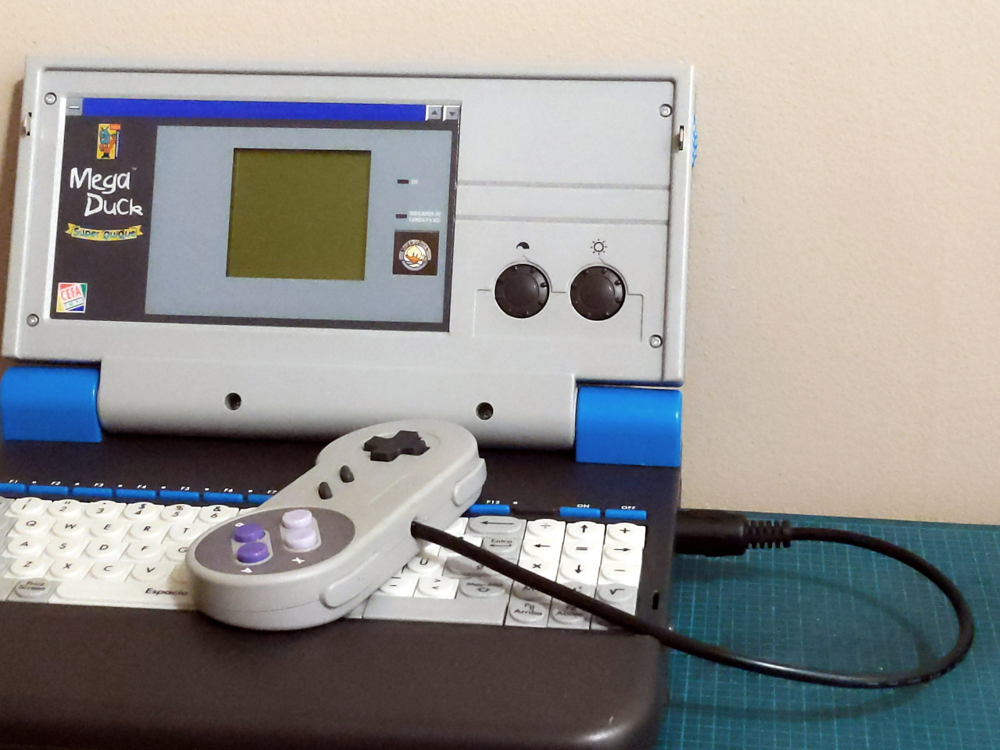
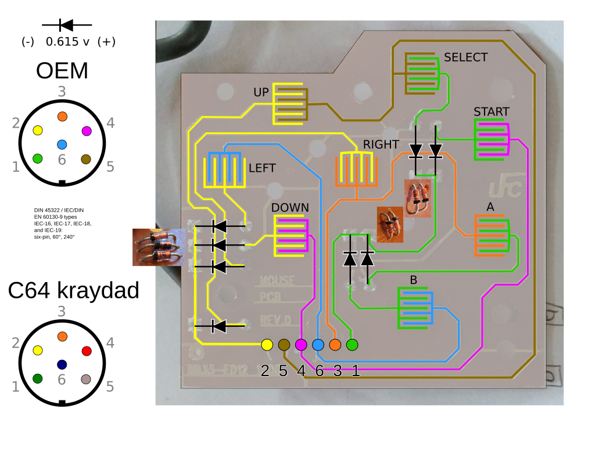
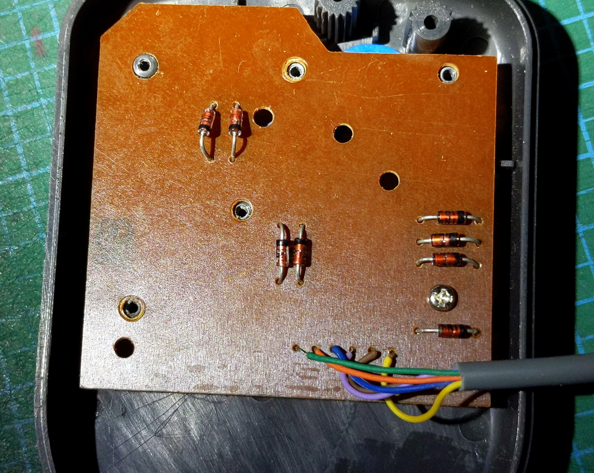
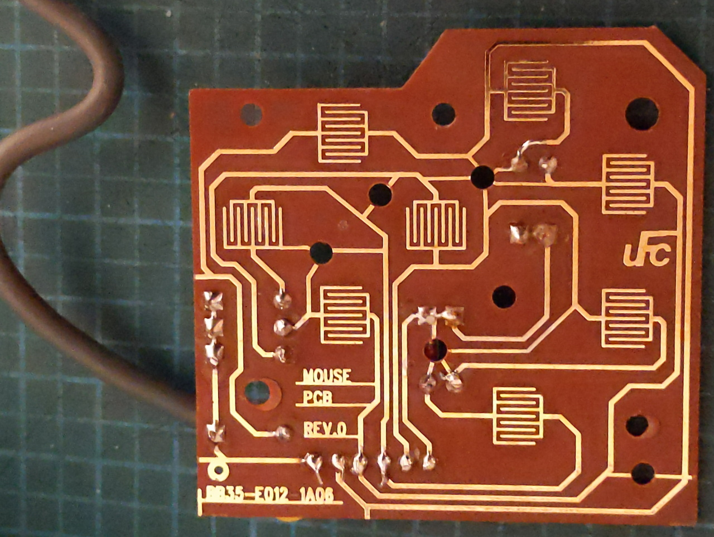
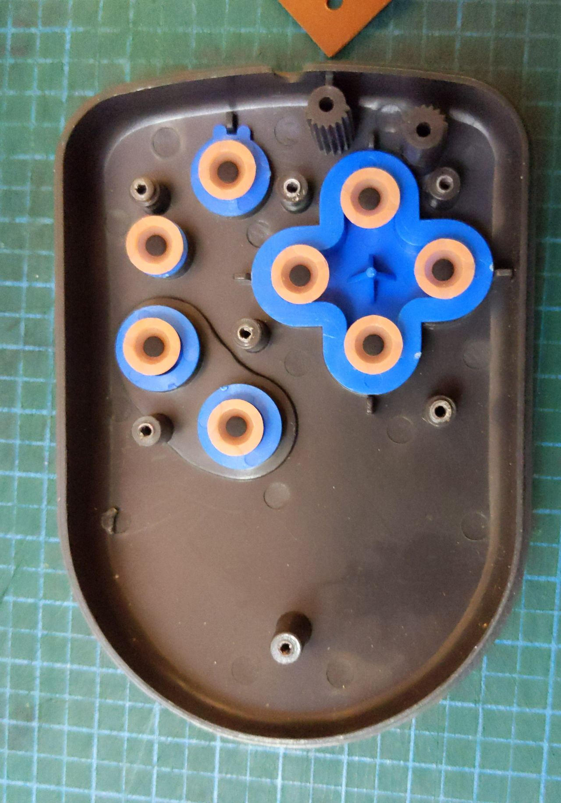

# Gamepad/Mouse for the MegaDuck laptop 
The laptop model of the MegaDuck (Super Quique / Hartung Super Junior) uses an external gamepad in the shape of a computer mouse. This document has pinout and wiring diagram sufficient to make a replacement.

### Cable
The gamepad/mouse uses a 6 pin DIN connector.

The following cable from Kraydad has a suitable connector. The cable wire colors may differ from the OEM ones and should always be checked to ensure which color maps to which pin.
- https://www.ebay.com/itm/233071555232
- https://www.ebay.com/itm/372816665018
- "3 or 6 ft Serial Cable for Commodore 64 C64 Disk Drive or printer 1541 1571 DIN 6 PIN"
- "Replacement 6 pin DIN cable for use with Commodore 64 disc drives and printers.  6 ft length. All pins wired straight through 1:1. Metal shells grounded. Manufactured by Kray Cables."

### Diodes
8 x 1N4148 Signal Diodes

### Cable Pinout and Wiring
The wiring for the buttons resembles what is used for Game Boy DMG and MGB models with two sets of buttons sharing common wiring and a method to select which set is being read.

 - [SVG version](../assets/quique/gamepad_mouse/megaduck_quique_laptop_mouse_gamepad_pcb_v4_norefpic.svg)

### OEM Gamepad / "Mouse"

